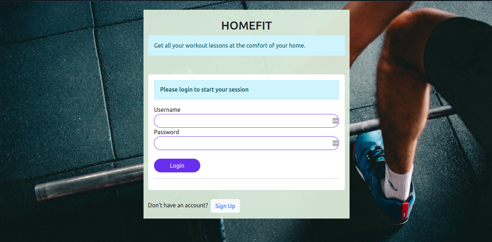
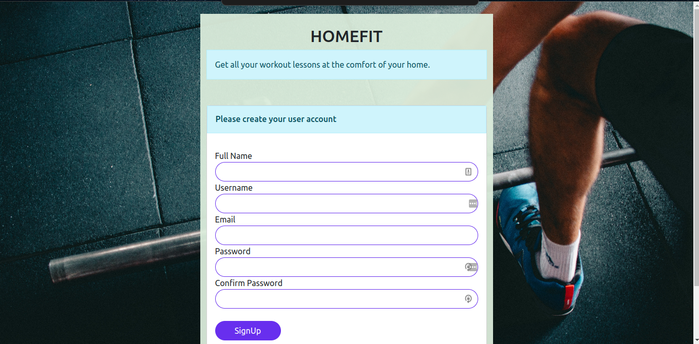
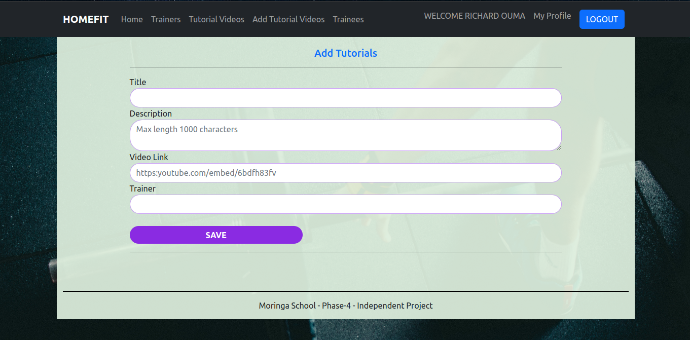

# HOMEFIT APP
Homefit App a web application that proovides reomote workout and yoga lessons  to individuals at their comfort.The lessons are inform of videos are free of charge to all individuals. A trainee only needs to  have an acces to the app ,ccreate an account and he/she ill be granted  all the available tutorial videos.

To get started with the project,you will be required to clone this repository.
Clone it here 

Run 
### ```bundle install```

Run Database Migrations 
### ```rails db:migrate ```

Seed Sample data
### ```rails db:seed```

Start the rail server 
### ```rails s```

Start the react frontend if you have have already cloned it.

The project backend server  will run on https://localhost:30000/  while 
The project frontend server  will run on https://localhost:4000/

Visit https://localhost:4000/ to view the project homepage.
You will be required to create an account before you are granted access to the full application. You are only required to create an account once as a trainee. For subsequent access , you will use the same username and password you provided during signup.

## Screenshots

LOGIN PAGE  
SIGNUP PAGE 

TRAINERS  
ADD TUTORIALS  
### Project Technologies
Frontend
---
+ HTML
+ CSS
+ React js

Backend
---
+ Ruby on rails
+ SQLite3

